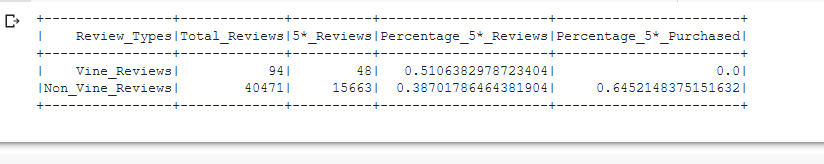

# Amazon Vine Analysis

## Overview
The purpose of this analysis is to extract review data from Amazon related to videogames and to analyze whether there are biases for paid/non-paid reviewers.

## Results

Data can be found in the data table below:
-We can see that there were 94 total vine reviews compared to 40,471 non-vine reviews
-Of those reviews, 48 vine members gave 5* ratings while 15,663 non-vine members gave 5* ratings
-Digging further, we see that as a percentage that about 51.1% of all vine reviews are 5* vs 38.7% from non-vine reviews

## Summary

Based on our results, there appears to be positive bias from vine reviewers as a larger portion of their reviews are 5* vs non-vine reviews. This belief appears to be reinforced when we look at whether vine members buy the games which are 5* rated i.e. an additional copy; surprisingly, none of the vine members bought an additional copy but about 64% of non-vine members bought the game for themselves. The thinking here is that if a game is 5* rated, those with that opinion should highly value the game; for vine members, even though they have a copy of the game, it still would've been expected some of them may buy an additional copy e.g. for exclusive collectibles, gift to friends, etc. 